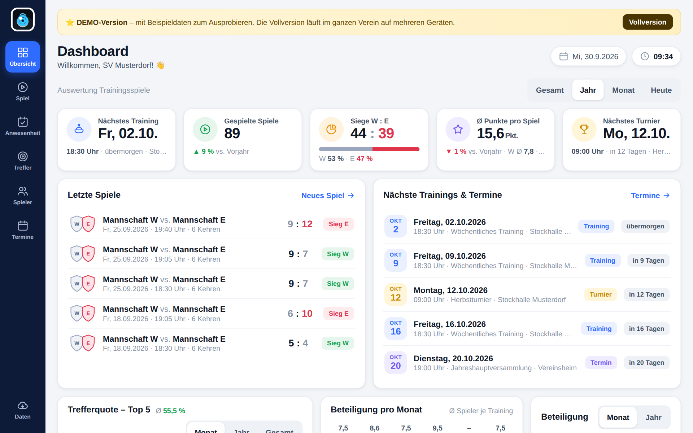
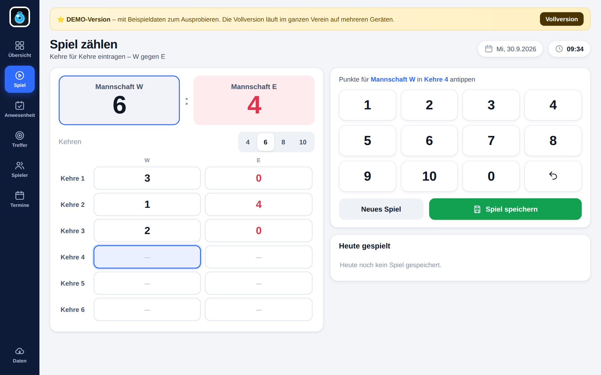
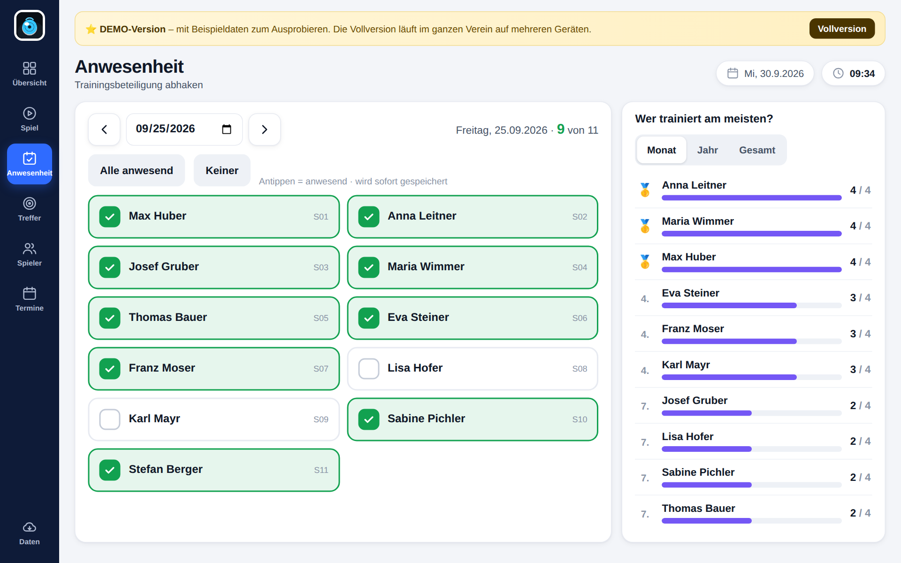

# 🥌 Stocksport Trainings APP – Tablet (Demo)

**Trainingsspiele zählen, Anwesenheit abhaken, Trefferquoten erfassen – und alles auf einen Blick auswerten.**
Die Tablet-Demo der Stocksport Trainings APP vom **ESV Grein**. Läuft direkt im Browser auf **iPad, Android-Tablet**, Handy oder PC, ohne Installation und ohne Server.

## Funktionen

| | |
|---|---|
| 📊 **Dashboard** | Nächstes Training & Turnier, gespielte Spiele, Siege W : E, Ø Punkte mit Trend zum Vorjahr, letzte Spiele, Top 5 Trefferquote, Beteiligung pro Monat |
| 🥌 **Spiel zählen** | Kehre für Kehre (4/6/8/10 Kehren), große Zifferntasten für die Bedienung an der Bahn |
| ✅ **Anwesenheit** | Spieler antippen, fertig. Rangliste „Wer trainiert am meisten?“ nach Monat/Jahr |
| 🎯 **Trefferquote** | Treffer % und Fehlschüsse % je Spieler und Training, Spielerauswertung |
| 👥 **Spieler & Termine** | Spielerliste, Trainingstag, Turniere und Vereinstermine |
| ☁️ **Sicherung in OneDrive** | Sicherungsdatei über das Teilen-Menü in OneDrive ablegen und auf jedem Gerät wieder öffnen |
| 📑 **Excel-Export** | Anwesenheit, Trefferquote und Spiele als CSV für Excel |
| 📱 **Offline & als App** | Einmal öffnen, dann auch ohne Internet nutzbar; auf dem Home-Bildschirm wie eine App |

## Ausprobieren

**Online:** `https://<dein-github-name>.github.io/stocksport-trainings-app-demo/` (siehe unten „Veröffentlichen“)

**Als App auf dem Tablet:**
- **iPad (Safari):** Seite öffnen → Teilen-Symbol → **„Zum Home-Bildschirm“**
- **Android (Chrome):** Seite öffnen → Menü ⋮ → **„App installieren“** bzw. „Zum Startbildschirm hinzufügen“

Die Demo startet mit dem Beispielverein **„SV Musterdorf“**. Unter **Daten → Leer starten** beginnt man mit dem eigenen Vereinsnamen.

## Daten & OneDrive

- Die Daten bleiben **auf dem Gerät** (im Browser). Es wird nichts an einen Server geschickt.
- **Daten → „In OneDrive sichern“** erzeugt eine Datei `Stocksport_<Verein>_<Datum>.json`:
  - **iPad:** im Teilen-Menü „In Dateien sichern“ → **OneDrive** wählen *(OneDrive-App muss installiert sein)*
  - **Android:** im Teilen-Menü **OneDrive** wählen
  - **PC:** die Datei wird heruntergeladen, dann in den OneDrive-Ordner verschieben
- **„Sicherung öffnen“** lädt die Datei auf einem anderen Tablet (Auswahl direkt aus OneDrive).
- Oben erscheint **„Sichern!“**, wenn seit der letzten Sicherung etwas geändert wurde.

> ⚠️ Wird der Browser-Verlauf bzw. werden die Websitedaten gelöscht, sind die Daten auf dem Gerät weg. Deshalb regelmäßig sichern.

## Veröffentlichen mit GitHub Pages

1. Auf GitHub ein neues Repository **`stocksport-trainings-app-demo`** anlegen (öffentlich).
2. **Add file → Upload files**: den **Inhalt** dieses Ordners hochladen (`index.html`, `manifest.webmanifest`, `sw.js`, `.nojekyll`, Ordner `icons` und `docs`, `README.md`, `LIZENZ.md`) → **Commit changes**.
3. **Settings → Pages** → Source: **Deploy from a branch** → Branch **main**, Ordner **/ (root)** → **Save**.
4. Nach 1–2 Minuten ist die App unter `https://<dein-github-name>.github.io/stocksport-trainings-app-demo/` erreichbar. Diesen Link bzw. einen QR-Code davon an die Vereine weitergeben.

**Update einspielen:** geänderte `index.html` hochladen und in `sw.js` die Versionsnummer erhöhen (`stocksport-tablet-v1.1`). Dann holen sich die Tablets beim nächsten Öffnen mit Internet die neue Version.

**Kontakt für Anfragen eintragen:** in `index.html` ganz oben im Skript bei `APP.kontakt` (und optional `APP.kontaktLink`, z. B. `mailto:…`).

### Was NICHT auf GitHub gehört
- Sicherungsdateien (`Stocksport_*.json`) und CSV-Exporte mit **echten Namen von Vereinsmitgliedern** (die `.gitignore` schließt sie aus)
- die Vollversion, der Lizenz-Generator und Schlüssel

## Vollversion

Die **Stocksport Trainings APP – Vereins-Edition** läuft auf einem Vereins-PC oder **Raspberry Pi** und verbindet alle Geräte:
gemeinsamer Datenstand auf allen Tablets und Bildschirmen, **Trainingsmodus PRO** für den großen Bildschirm an der Bahn,
Einzeltraining & Trainingsanalyse, unbegrenzt Spieler, Datenbank mit täglicher Sicherung, Excel-Datei,
Google-Kalender-Anbindung und eine Vereinslizenz mit eurem Namen.

**Anfragen:** ESV Grein – Stocksport

---
© ESV Grein. Die Demo darf zum Ausprobieren verwendet werden; Weitergabe, Veränderung und Verkauf sind nicht gestattet. Details in [LIZENZ.md](LIZENZ.md).
